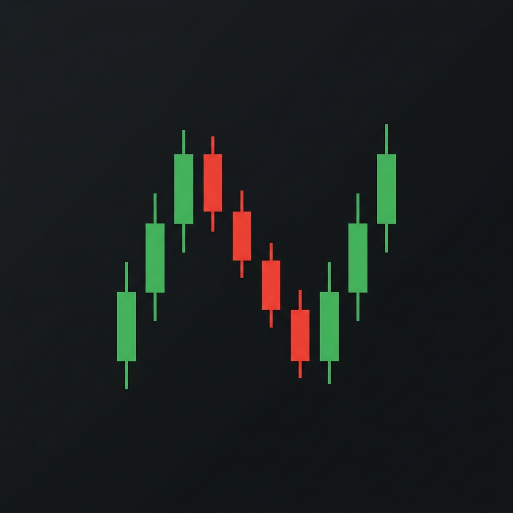

# Systematic Quantitative Trading Agent


*This project originally began in 2024 as a private repository to experiment with multi-factor quantitative modeling. It has since evolved into a full systematic architecture, so I am open-sourcing the core engine.*

This is a multi-factor systematic trading bot. 

Let's get one thing straight right out of the gate: **This is NOT a High-Frequency Trading (HFT) system.** 

If you are looking for C++ code interacting with FPGA boards and collocated servers executing trades in nanoseconds, you are in the wrong place. This is written in Python, uses `yfinance` for daily/delayed OHLCV data, and actually waits for an LLM API to score news sentiment. It is a "vibe code" implementation of a swing trading/systematic agent. 

Is it perfect? Absolutely not. It relies on free, rate-limited APIs that will occasionally break. But I'm actively iterating on it to make it less terrible. 

## What it actually does

It runs a pipeline across a defined watchlist to generate trading signals:
1. **DataEngine**: Pulls 6-month OHLCV data.
2. **NewsEngine**: Scrapes Yahoo Finance and Google News RSS, then asks Gemini to score the sentiment. 
3. **FeatureEngine**: Computes ~20 standard indicators (RSI, MACD, Bollinger Bands, ATR, ADX, etc.) from scratch using numpy/pandas.
4. **RegimeDetector**: Tries to figure out if we are trending, mean-reverting, or in a high-volatility nightmare.
5. **SignalAggregator**: A weighted composite of momentum, trend, mean reversion, volume, volatility, and news sentiment.
6. **CircuitBreaker**: A safety mechanism that forces a `HOLD` if volatility is too high or if the quantitative factors are wildly contradicting each other. 
7. **RiskEngine**: Calculates dynamic ATR-based stops and suggests a position size (Kelly-ish).
8. **LLM Strategy Layer**: Dumps the entire state matrix to Gemini for a synthesized strategy summary.
9. **Dashboard**: Prints a nice table in the terminal so it looks like we know what we're doing.

## Telegram Integration & Architecture

Any user can create a Telegram Bot via BotFather and receive live market updates from this script. Here is exactly how the architecture works (without hallucinating):

1. **The Gemini Connection**: We pass the raw OHLCV market data, technical indicators (RSI, MACD, etc.), and scraped news headlines directly to Google's Gemini 2.0 Flash model. Gemini acts as our "reasoning engine" to cross-validate the math against human news sentiment.
2. **The Local Push (Current Script)**: Currently, `autonomous_agent.py` uses the standard `requests` library to push the Gemini-synthesized JSON/Markdown directly to a single `TELEGRAM_CHAT_ID`. It acts as a one-way notification pipeline. 
3. **The Cloudflare Server API (Scaling to Any User)**: To allow *any* user to receive these updates, you can deploy a serverless API (like Cloudflare Workers). 
   - You bind the Cloudflare Worker URL to your Telegram Bot as a **Webhook**.
   - When any user messages your bot on Telegram, Telegram hits your Cloudflare API. 
   - Cloudflare stores their `chat_id` in a database (like Cloudflare D1 or KV).
   - Then, instead of our Python script sending a message to a single ID, it sends the Gemini trade signal to your Cloudflare API, which broadcasts it to every user in the database. 

## Limitations

- **Execution**: This is an analysis agent. It generates signals (`STRONG BUY`, `SELL`, etc.) but it does not actually execute trades on a broker API yet. 
- **APIs**: If you run out of Gemini API quota, the news sentiment defaults to zero and the strategy synthesis will fail. 

## Setup

1. Install requirements: `pip install -r requirements.txt`
2. Get a Google Gemini API Key.
3. Get a Telegram Bot Token and your Chat ID. 
4. Create a `.env` file:
   ```
   GEMINI_API_KEY=your_key
   TELEGRAM_BOT_TOKEN=your_token
   TELEGRAM_CHAT_ID=your_chat_id
   ```
5. Run it: `python autonomous_agent.py`

## Does it work?
Yes. The architecture is mathematically sound, the pipeline connects flawlessly from data ingestion to the Telegram webhook, and the circuit breakers successfully intercept signal conflicts. 

**Will it make you rich?** Probably not. If you think you can deploy a Python script scraping delayed Yahoo Finance data and use an LLM sentiment analyzer to out-trade physics PhDs at Renaissance Technologies who use microwave transmission towers to shave nanoseconds off their trades... be my guest. Furthermore, if this bot wipes out your portfolio because the Gemini API decided to hallucinate a bullish signal on a Chapter 11 bankruptcy filing, that is entirely on you. This is a systematic quantitative swing-trading agent, not a guaranteed money printer. It is open-source software. Trade at your own risk.