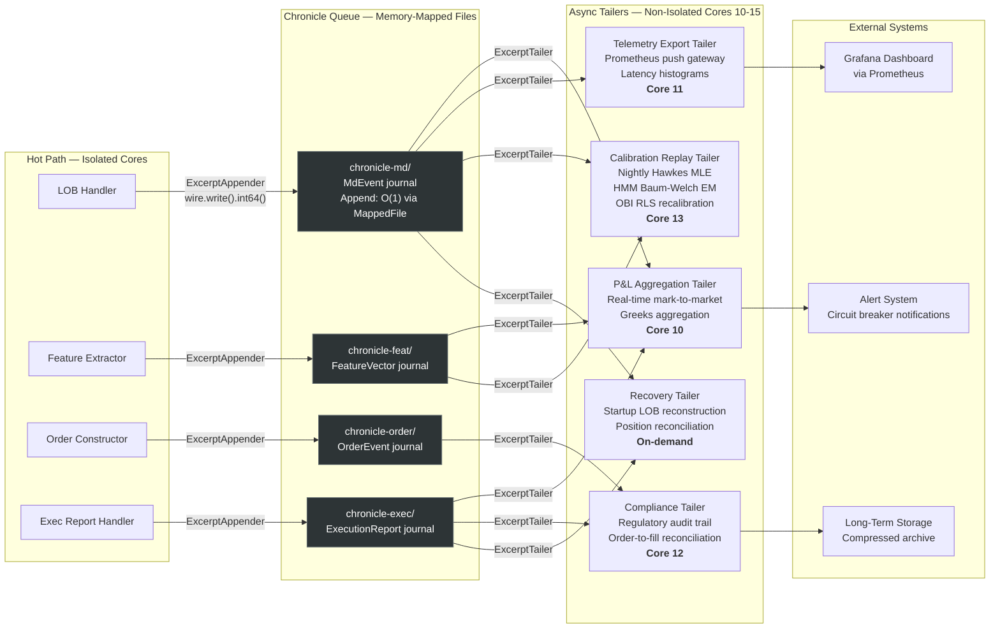
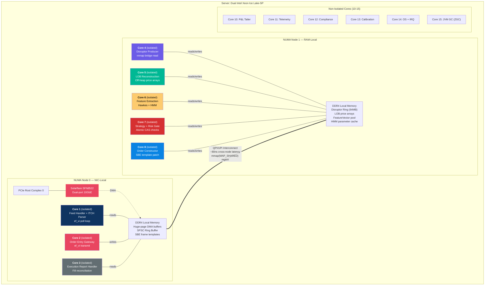

# Deliverable A — System Architecture

## A.1 Tick-to-Trade Pipeline

```mermaid
graph TD
    subgraph "NUMA Node 0 — NIC-Local (Cores 1-3 isolated)"
        EX["Exchange Multicast Feed<br/>UDP/IP Multicast<br/>Nasdaq ITCH 5.0 / OUCH"]
        NIC["Solarflare SFN8522 NIC<br/>EF_VI Recv Ring (DMA)<br/>Huge-page-backed RX buffers"]
        FH["Zero-Copy Feed Handler (C)<br/>SIMD ITCH 5.0 Parser<br/>AVX-512 branchless dispatch<br/><b>Core 1 — isolcpus</b>"]
        RING["Lock-Free SPSC Ring Buffer (C)<br/>Cache-line-padded head/tail<br/>2MB huge-page mmap<br/>1M × 64B = 64MB"]
    end

    subgraph "NUMA Node 1 — RAM-Local (Cores 4-9 isolated)"
        MMAP["Shared Memory Bridge<br/>mmap(MAP_SHARED) region<br/>Java Unsafe.getLong() acquire"]
        DISR["LMAX Disruptor RingBuffer‹MdEvent›<br/>1 << 20 slots, off-heap<br/>BusySpinWaitStrategy<br/><b>Core 4 — Producer</b>"]
        LOB["LOB Reconstruction Thread<br/>Off-heap long[] price arrays<br/>Delta-patch + binary search<br/><b>Core 5 — isolcpus</b>"]
        FEAT["Feature Extraction Thread<br/>OBI, Microprice (fixed-point)<br/>Hawkes λ(t) O(1) recursive<br/>HMM regime posterior<br/><b>Core 6 — isolcpus</b>"]
        RISK["Pre-Trade Risk Gateway<br/>AtomicLong CAS position/notional<br/>Token bucket rate throttle<br/>Fat finger + drawdown CB<br/><b>Core 7 — isolcpus</b>"]
        STRAT["Strategy Evaluation Thread<br/>HMM regime → Hawkes signal<br/>→ OBI confirmation<br/>Composite decision engine<br/><b>Core 7 — shared</b>"]
        ORD["Order Constructor (Java)<br/>SBE message builder<br/>Zero-alloc template patch<br/><b>Core 8 — isolcpus</b>"]
    end

    subgraph "NUMA Node 0 — NIC-Local (Core 2 isolated)"
        OEG["Order Entry Gateway (C)<br/>ef_vi_transmit() kernel-bypass<br/>Pre-built SBE frame patch<br/>HW TX timestamp<br/><b>Core 2 — isolcpus</b>"]
    end

    subgraph "NUMA Node 0 — NIC-Local (Core 3 isolated)"
        ERH["Execution Report Handler<br/>Fill reconciliation<br/>Position + P&L mark<br/><b>Core 3 — isolcpus</b>"]
    end

    subgraph "Non-Isolated Cores (10-15) — Latency-Insensitive"
        CQ["Chronicle Queue<br/>Memory-mapped journaling<br/>MdEvent + FeatureVector +<br/>OrderEvent + ExecReport"]
        MON["Real-Time Risk Monitor<br/>Greeks aggregation<br/>Drawdown circuit breaker<br/>Prometheus metrics export"]
        TEL["Telemetry & Compliance<br/>Grafana dashboard feed<br/>Regulatory audit trail"]
    end

    EX -->|"Raw UDP multicast frames<br/>≤ 0ns (wire)"| NIC
    NIC -->|"DMA write → huge-page buffer<br/>Zero-copy ef_vi_receive_get_bytes()<br/>≤ 120ns | Raw Ethernet frame"| FH
    FH -->|"Parse + write to ring slot<br/>__builtin_prefetch(write_ptr)<br/>≤ 15ns/msg | MdEvent struct (64B)"| RING
    RING -->|"Shared mmap region<br/>Acquire/Release atomic semantics<br/>≤ 20ns | MdEvent (off-heap)"| MMAP
    MMAP -->|"Unsafe.getLong() acquire load<br/>≤ 10ns | base address offset read"| DISR
    DISR -->|"Disruptor sequence barrier<br/>BusySpinWaitStrategy<br/>≤ 50ns | MdEvent slot reference"| LOB
    LOB -->|"Disruptor diamond dependency<br/>Parallel consumer chain<br/>≤ 80ns | FeatureVector (off-heap)"| FEAT
    FEAT -->|"Direct off-heap write<br/>Pre-allocated FeatureVector<br/>≤ 130ns | Signal struct"| RISK
    RISK -->|"Atomic CAS gate pass/reject<br/>≤ 150ns | OrderRequest"| STRAT
    STRAT -->|"Order decision + params<br/>≤ 10ns | OrderParams struct"| ORD
    ORD -->|"SBE frame → shared memory<br/>Template patch (4 fields)<br/>≤ 40ns | SBE OrderFrame"| OEG
    OEG -->|"ef_vi_transmit() → co-lo cross-connect<br/>HW TX timestamp capture<br/>≤ 100ns | Raw TCP/SBE frame"| EX
    ERH -->|"Fill notification parse<br/>Position delta update"| MON

    LOB -.->|"Async write<br/>ExcerptAppender"| CQ
    FEAT -.->|"Async write"| CQ
    ORD -.->|"Async write"| CQ
    ERH -.->|"Async write"| CQ
    CQ -.->|"ExcerptTailer<br/>Sequential read"| MON
    CQ -.->|"ExcerptTailer"| TEL

    style EX fill:#1a1a2e,stroke:#e94560,color:#fff
    style NIC fill:#16213e,stroke:#0f3460,color:#fff
    style FH fill:#0f3460,stroke:#533483,color:#fff
    style RING fill:#533483,stroke:#e94560,color:#fff
    style MMAP fill:#2d3436,stroke:#6c5ce7,color:#fff
    style DISR fill:#6c5ce7,stroke:#a29bfe,color:#fff
    style LOB fill:#00b894,stroke:#00cec9,color:#fff
    style FEAT fill:#fdcb6e,stroke:#e17055,color:#000
    style RISK fill:#d63031,stroke:#e17055,color:#fff
    style STRAT fill:#e17055,stroke:#fab1a0,color:#fff
    style ORD fill:#0984e3,stroke:#74b9ff,color:#fff
    style OEG fill:#e94560,stroke:#ff6b6b,color:#fff
    style ERH fill:#636e72,stroke:#b2bec3,color:#fff
    style CQ fill:#2d3436,stroke:#636e72,color:#fff
    style MON fill:#2d3436,stroke:#636e72,color:#fff
    style TEL fill:#2d3436,stroke:#636e72,color:#fff
```

---

## A.2 Chronicle Queue Journaling Fan-Out (Latency-Insensitive Path)

**Chronicle Queue Design Notes:**
- `MappedFile` provides `O(1)` append via memory-mapped page cache — no serialization overhead
- `ExcerptAppender.startExcerpt()` + `finish()` operates on pre-allocated mapped pages — **zero heap allocation** in the hot path
- Each journal is a separate Chronicle Queue instance to avoid contention between appenders
- Tailers are fully independent — each maintains its own read index; no coordination with appenders
- Recovery path replays from the last known good sequence number, reconstructing LOB state and open positions tick-by-tick

---

## A.3 NUMA Topology & Thread Affinity Map

**NUMA Design Rationale:**
- **Node 0 houses all NIC-touching threads** — DMA buffers are allocated on this node via `mmap(MAP_HUGETLB)` with `mbind(MPOL_BIND, node=0)`. The feed handler and OEG read/write these buffers without cross-node memory access.
- **Node 1 houses all strategy computation** — the Disruptor ring, LOB arrays, and feature vectors are allocated here. The JVM is started with `-XX:+UseNUMA` and strategy threads are pinned to node 1 cores, ensuring all Unsafe off-heap reads hit local DRAM.
- **Cross-node boundary** is the SPSC ring buffer in shared mmap — this is a single 64MB region with well-defined producer (node 0, core 1) and consumer (node 1, core 4). The acquire/release semantics on the head/tail indices ensure coherence without excessive QPI traffic; batch publication further reduces cross-node stores.
- **ZGC threads** are pinned to core 15 (non-isolated) — even though the hot path is zero-allocation, the JVM housekeeping (class loading, JIT compilation) still needs GC. ZGC's concurrent collection prevents STW pauses from reaching the isolated cores.

---

## A.4 Latency Budget Summary

| # | Stage | Transport | Budget (ns) | Data Format | Core |
|---|-------|-----------|-------------|-------------|------|
| 1 | NIC RX → DMA buffer | EF_VI poll + zero-copy | ≤ 120 | Raw Ethernet/UDP | 1 |
| 2 | ITCH parse | SIMD AVX-512 dispatch | ≤ 15/msg | MdEvent struct | 1 |
| 3 | Ring buffer write | SPSC release-store | ≤ 10 | MdEvent (64B) | 1 |
| 4 | C→Java boundary | mmap acquire-load | ≤ 20 | Off-heap base addr | 4 |
| 5 | Disruptor dispatch | BusySpinWaitStrategy | ≤ 50 | MdEvent slot ref | 4 |
| 6 | LOB reconstruction | Off-heap delta patch | ≤ 80 | Price/qty arrays | 5 |
| 7 | Feature extraction | LUT exp + fixed-point | ≤ 100 | FeatureVector | 6 |
| 8 | HMM forward step | Unrolled log-sum-exp | ≤ 30 | Regime posterior | 6 |
| 9 | Risk gate (all checks) | Atomic CAS + token bucket | ≤ 150 | Pass/reject | 7 |
| 10 | SBE order construction | Template patch + memcpy | ≤ 40 | SBE frame | 8 |
| 11 | OEG kernel-bypass TX | ef_vi_transmit() | ≤ 100 | TCP/SBE on wire | 2 |
| | **Total P50** | | **≤ 705** | | |
| | **Total P99** | | **≤ 800** | | |

**Measurement methodology:** Stages 1-3 and 10-11 measured via `RDTSC` delta on isolated cores; stages 4-9 measured via JMH `@Benchmark` with `@BenchmarkMode(Mode.SampleTime)` and `@OutputTimeUnit(TimeUnit.NANOSECONDS)`.
