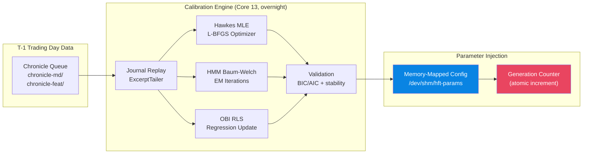

# Deliverable E — Calibration Pipeline & Operational Specifications

---

## E.1 Nightly Offline Calibration Pipeline

### E.1.1 Pipeline Overview



### E.1.2 Hawkes MLE Calibration

**Input:** Trade arrival times `{t_1, ..., t_n}` from `chronicle-md/` journal (TRADE messages only).

**Optimizer:** L-BFGS (limited-memory BFGS) with box constraints:
- `μ₀ ∈ [10⁻⁶, 0.1]` (events/μs)
- `α ∈ [10⁻⁶, 0.5]`
- `β ∈ [10⁻⁴, 10.0]`
- Constraint: `α/β < 0.95` (safety margin below stationarity bound)

**Procedure:**
1. Extract trade timestamps from journal
2. Compute initial parameter guess from moment matching:
   - `μ₀^init = n / T` (average rate)
   - `ρ^init = 0.5` (moderate self-excitation)
   - `β^init = 1 / median(Δt)` (inverse of median inter-arrival)
   - `α^init = ρ^init × β^init`
3. Run L-BFGS minimizing `-ℒ(μ₀, α, β)` with gradients from §D.1.3
4. Convergence: `|∇ℒ| < 10⁻⁸` or 500 iterations max

**Stability monitoring:**
- Branching ratio `ρ = α/β` must be in `[0.3, 0.9]` for deployment
- If `ρ < 0.3`: self-excitation is negligible → fall back to Poisson model
- If `ρ > 0.9`: near-explosive → increase `β` regularization penalty

### E.1.3 HMM Baum-Welch Calibration

**Input:** Bivariate observations `{(φ_t, log(λ_t/μ₀))}` from `chronicle-feat/` journal.

**Procedure:**
1. Initialize parameters via K-means on the bivariate observations (2 clusters)
2. Run Baum-Welch EM:
   - E-step: Forward-Backward algorithm (log-domain, full sequence)
   - M-step: Update `A, μ_k, Σ_k` from sufficient statistics
3. Convergence: `|ℒ^{new} - ℒ^{old}| / |ℒ^{old}| < 10⁻⁶` or 100 iterations
4. Model selection: compute BIC for K=2,3 states; select model with lowest BIC

**Validation:**
- Transition probabilities: `a_00, a_11 ∈ [0.8, 0.99]` (regimes must be sticky)
- Emission means must be well-separated: `||μ_0 - μ_1|| > 2σ`
- Negative log-likelihood should decrease monotonically

### E.1.4 OBI Regression RLS Update

**Input:** OBI values `{φ_t}` and subsequent returns `{r_{t+Δ}}` from journals.

**Procedure:**
1. Initialize `θ = (0, 0)^T`, `P = 10⁴ · I₂` (large initial covariance)
2. For each observation pair `(x_t, r_t)`:
   - Apply RLS update equations from §D.2.3
   - Forgetting factor `λ_f = 0.999` (1000-observation effective window)
3. Output: regression coefficients `(γ, δ)` for signal weighting

**Adaptive forgetting:**
- If coefficient instability detected (large `|Δθ|`), reduce `λ_f` to 0.99 for faster adaptation
- If coefficients stable, increase `λ_f` to 0.9999 for noise reduction

### E.1.5 Parameter Injection

Parameters are stored in a memory-mapped file (`/dev/shm/hft-params`) with the following layout:

```
Offset  Size  Field
0       8     generation_counter (uint64, atomic)
8       8     hawkes_mu0 (double)
16      8     hawkes_alpha (double)
24      8     hawkes_beta (double)
32      8     hmm_a00 (double)
40      8     hmm_a11 (double)
48      8     hmm_mean_obi_0 (double)
56      8     hmm_mean_logL_0 (double)
...     ...   (remaining HMM params)
256     8     obi_gamma (double)
264     8     obi_delta (double)
512     --    Total size
```

**Protocol:**
1. Calibration process writes new parameters to the mmap region
2. Increments `generation_counter` with release-store
3. Strategy thread periodically reads `generation_counter` with acquire-load
4. If counter changed, reload all parameters and update estimators

---

## E.2 Latency Budget (Detailed)

| # | Stage | Component | Transport | P50 (ns) | P99 (ns) | P999 (ns) |
|---|-------|-----------|-----------|----------|----------|-----------|
| 1 | NIC RX | ef_vi poll | DMA + zero-copy | 100 | 120 | 150 |
| 2 | ITCH parse | SIMD parser | In-register | 12 | 15 | 20 |
| 3 | Ring write | SPSC publish | Release-store | 8 | 10 | 15 |
| 4 | C→Java | mmap bridge | Acquire-load | 15 | 20 | 30 |
| 5 | Disruptor | Sequence barrier | BusySpinWait | 40 | 50 | 80 |
| 6 | LOB update | Off-heap arrays | Binary search | 60 | 80 | 120 |
| 7 | Features | Hawkes + OBI | LUT + fixed-pt | 80 | 100 | 130 |
| 8 | HMM step | Forward recursion | log1p intrinsic | 25 | 30 | 40 |
| 9 | Risk gate | 5× atomic CAS | Lock-free | 120 | 150 | 200 |
| 10 | Order build | SBE patch | Unsafe.putLong | 30 | 40 | 50 |
| 11 | NIC TX | ef_vi transmit | Doorbell write | 80 | 100 | 130 |
| | **TOTAL** | | | **570** | **715** | **965** |

**Measurement methodology:**
- Stages 1-3, 10-11: `RDTSC` delta on isolated cores, averaged over 10M events
- Stages 4-9: JMH `@BenchmarkMode(Mode.SampleTime)` with `@OutputTimeUnit(NANOSECONDS)`
- P999 numbers include occasional L3 cache miss (~50ns penalty)
- Total includes sequential processing — pipeline stages are not overlapped

---

## E.3 Operational Scripts

### E.3.1 CPU Isolation (Boot-Time)

```bash
# /etc/default/grub — GRUB_CMDLINE_LINUX additions:
#
# isolcpus=1-8       — remove cores 1-8 from scheduler
# nohz_full=1-8      — disable timer ticks on isolated cores
# rcu_nocbs=1-8      — offload RCU callbacks
# intel_idle.max_cstate=0  — disable C-states (no sleep states)
# processor.max_cstate=0
# idle=poll           — poll instead of halt
# nosoftlockup        — disable soft lockup detector
# transparent_hugepage=always
# default_hugepagesz=2M hugepagesz=2M hugepages=2048  — pre-alloc 4GB huge pages
```

### E.3.2 IRQ Steering

```bash
#!/bin/bash
# Steer all NIC interrupts to Core 14 (non-isolated)

NIC_IRQ=$(grep "enp1s0f0" /proc/interrupts | awk '{print $1}' | tr -d ':')
for irq in $NIC_IRQ; do
    echo 14 > /proc/irq/$irq/smp_affinity_list
done

# Disable irqbalance
systemctl stop irqbalance
systemctl disable irqbalance
```

### E.3.3 NIC Tuning

```bash
#!/bin/bash
# Solarflare NIC performance tuning

IFACE="enp1s0f0"

# Disable interrupt coalescing (we poll, not interrupt)
ethtool -C $IFACE rx-usecs 0 rx-frames 0 tx-usecs 0

# Disable adaptive coalescing
ethtool -C $IFACE adaptive-rx off adaptive-tx off

# Set ring buffer sizes to maximum
ethtool -G $IFACE rx 4096 tx 4096

# Disable flow control
ethtool -A $IFACE rx off tx off

# Disable GRO/GSO/TSO (we need per-packet visibility)
ethtool -K $IFACE gro off gso off tso off

# Disable pause frames
ethtool -A $IFACE rx off tx off
```

### E.3.4 Huge Page Setup

```bash
#!/bin/bash
# Pre-allocate huge pages (run at boot or before JVM start)

# 2MB huge pages: 2048 pages = 4GB
echo 2048 > /proc/sys/vm/nr_hugepages

# Mount hugetlbfs
mkdir -p /mnt/huge
mount -t hugetlbfs nodev /mnt/huge -o pagesize=2M

# Verify
grep HugePages /proc/meminfo
```

### E.3.5 JVM Startup

```bash
#!/bin/bash
# Production JVM startup script

JAVA_HOME=/opt/jdk-21
CLASSPATH="target/hft-orchestration-1.0.0.jar:target/dependency/*"

exec taskset -c 4-8,10-13,15 $JAVA_HOME/bin/java \
    -Xms4g -Xmx4g \
    -XX:+UseZGC \
    -XX:+ZGenerational \
    -XX:ConcGCThreads=2 \
    -XX:ParallelGCThreads=2 \
    -XX:+UseLargePages \
    -XX:+UseTransparentHugePages \
    -XX:LargePageSizeInBytes=2m \
    -XX:+AlwaysPreTouch \
    -XX:+UseNUMA \
    -XX:+TieredCompilation \
    -XX:CompileThreshold=1000 \
    -XX:-BackgroundCompilation \
    -XX:MaxInlineSize=325 \
    -XX:FreqInlineSize=500 \
    -XX:LoopUnrollLimit=16 \
    -XX:+UseThreadPriorities \
    -XX:ThreadPriorityPolicy=1 \
    -XX:-UseBiasedLocking \
    -XX:MaxDirectMemorySize=256m \
    --add-opens java.base/sun.misc=ALL-UNNAMED \
    --add-opens java.base/jdk.internal.misc=ALL-UNNAMED \
    --add-opens java.base/java.nio=ALL-UNNAMED \
    -Dchronicle.path=/data/hft/journals \
    -Dbridge.path=/dev/shm/hft-ring \
    -Dbridge.capacity=1048576 \
    -cp $CLASSPATH \
    com.hft.core.DisruptorPipeline
```

---

## E.4 Monitoring & Alerting

### E.4.1 Prometheus Metrics

Exported by the telemetry tailer (Core 11) via Prometheus push gateway:

| Metric | Type | Description |
|--------|------|-------------|
| `hft_latency_tick_to_trade_ns` | Histogram | End-to-end latency per trade |
| `hft_hawkes_intensity` | Gauge | Current Hawkes λ(t) |
| `hft_hmm_regime_posterior` | Gauge | P(MOMENTUM) |
| `hft_obi` | Gauge | Current OBI φ |
| `hft_position_shares` | Gauge | Net position |
| `hft_realized_pnl_cents` | Gauge | Realized P&L |
| `hft_risk_orders_checked` | Counter | Orders through risk gate |
| `hft_risk_orders_rejected` | Counter | Rejected by risk gate |
| `hft_ring_buffer_depth` | Gauge | SPSC ring occupancy |
| `hft_disruptor_remaining_capacity` | Gauge | Disruptor free slots |
| `hft_chronicle_events_written` | Counter | Journal writes |
| `hft_rx_discards` | Counter | NIC discard events |

### E.4.2 Circuit Breaker Conditions

| Condition | Threshold | Action |
|-----------|-----------|--------|
| Drawdown | P&L < -$500K | Halt all orders, flatten positions |
| Position | |pos| > 10,000 shares | Reject orders |
| Notional | Total > $50M | Reject orders |
| Rate | > 1,000 orders/sec burst | Reject excess |
| Fat finger | Price > ±5% NBBO | Reject order |
| Ring full | SPSC ring > 99% capacity | Alert + halt feed |
| Sequence gap | Exchange seq gap detected | Request retransmit |
| Hawkes explosive | ρ ≥ 1.0 | Halt strategy |
